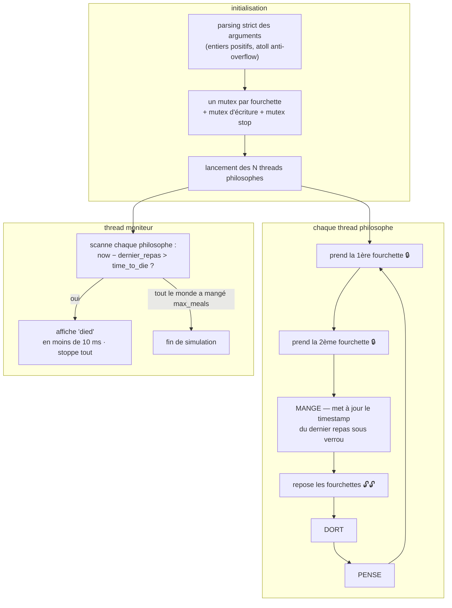

# Philosophers

 

Le problème des philosophes de Dijkstra : N philosophes autour d'une table avec N fourchettes, chacun a besoin de deux fourchettes pour manger, puis dort, puis pense. Un thread par philosophe, un mutex par fourchette. Pas de data race, pas de deadlock, morts annoncées en moins de 10 ms.

```bash
./philo nb_philos time_to_die time_to_eat time_to_sleep [nb_repas_max]
./philo 5 800 200 200
```

## Conception



- **Prévention des deadlocks par ordre des fourchettes** — chaque philosophe stocke sa fourchette `first` et `second` pour toujours verrouiller la paire dans un ordre cohérent ; l'attente circulaire ne peut pas se former.
- **Moniteur dédié** (`boss.c`) qui surveille le timestamp du dernier repas de chaque philosophe et déclare une mort dans la fenêtre de 10 ms.
- **Deux mutex de service** — l'un sérialise l'affichage (pas de logs entremêlés), l'autre protège le flag d'arrêt global.
- **Chronométrage à la milliseconde** sur `gettimeofday`, avec un sleep maison qui reste précis sur les longues attentes.

Propre sous `valgrind --tool=helgrind` (races) et `--tool=memcheck` (fuites).

## Tests de référence

| Commande | Attendu |
|---|---|
| `./philo 1 800 200 200` | une seule fourchette → meurt à ~800 ms |
| `./philo 5 800 200 200` | personne ne meurt |
| `./philo 5 800 200 200 7` | s'arrête quand tout le monde a mangé 7 fois |
| `./philo 4 410 200 200` | planning serré — personne ne meurt |
| `./philo 4 310 200 100` | un philosophe meurt |

## Compilation & lancement

```bash
make
./philo 5 800 200 200 7
```
