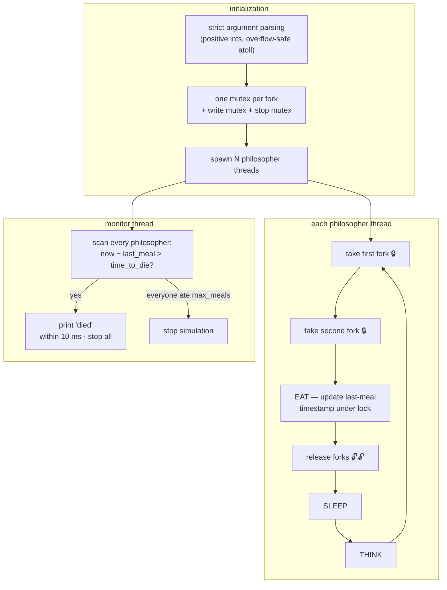

# Philosophers

 

Dijkstra's dining philosophers problem: N philosophers around a table with N forks, each needs two forks to eat, then sleeps, then thinks. One thread per philosopher, one mutex per fork. No data races, no deadlocks, deaths reported within 10 ms.

```bash
./philo number_of_philos time_to_die time_to_eat time_to_sleep [max_meals]
./philo 5 800 200 200
```

## Design



- **Deadlock prevention by fork ordering** — each philosopher stores its `first` and `second` fork so the pair is always locked in a consistent order; circular wait can't form.
- **Dedicated monitor** (`boss.c`) polls each philosopher's last-meal timestamp and declares a death within the 10 ms window.
- **Two service mutexes** — one serializes output (no interleaved logs), one protects the global stop flag.
- **Millisecond timing** on `gettimeofday`, with a custom sleep that stays accurate on long waits.

Clean under `valgrind --tool=helgrind` (races) and `--tool=memcheck` (leaks).

## Reference tests

| Command | Expected |
|---|---|
| `./philo 1 800 200 200` | one fork only → dies at ~800 ms |
| `./philo 5 800 200 200` | nobody dies |
| `./philo 5 800 200 200 7` | stops after everyone ate 7 times |
| `./philo 4 410 200 200` | tight schedule — nobody dies |
| `./philo 4 310 200 100` | one philosopher dies |

## Build & run

```bash
make
./philo 5 800 200 200 7
```
